# HitMachine Smart Contracts - System Architecture

## Overview

HitMachine is a self-sustaining referral and album purchase system built on the Sophon network. The system creates a circular economy where initial job payments generate album purchases, which create commissions that fund future job payments.

## System Actors

### 1. **Nano Wallet** (System Operator)
- **Role**: Central operator that manages the referral system
- **Permissions**: 
  - `JOB_PAYER_ROLE` in Jobs contract
  - `COMMISSION_CLAIMER_ROLE` in Store contract
- **Responsibilities**:
  - Initially funds the Jobs contract
  - Pays workers for completing jobs (wallet generation)
  - Claims referral commissions from Store
  - Directs commissions back to Jobs contract

### 2. **Workers** (Job Completers)
- **Role**: Complete tasks like generating wallets for new users
- **Receives**: USDC and SOPH tokens as payment for jobs
- **Interaction**: Paid by Nano wallet through Jobs contract

### 3. **Users** (Album Purchasers)
- **Role**: End users who purchase albums
- **Actions**: 
  - Receive funded wallets from workers
  - Purchase albums using USDC
- **Cost**: 0.01 USDC per album

### 4. **Admin**
- **Role**: System administrator
- **Permissions**: Can upgrade contracts, pause system, emergency withdrawals

## Smart Contracts

### 1. **Store Contract** (`StoreV2.sol`)
- **Purpose**: Handles album sales and commission distribution
- **Key Functions**:
  - `buyAlbum()` - Users purchase albums
  - `claimReferralCommissions()` - Nano wallet claims commissions
  - `claimAllReferralCommissions()` - Nano wallet claims all available commissions
- **Revenue Flow**: Collects USDC from album sales → Nano claims as commissions

### 2. **Jobs Contract** (`Jobs.sol`)
- **Purpose**: Manages payments to workers for completing jobs
- **Key Functions**:
  - `payForJob()` - Nano wallet pays workers
  - `receiveFunds()` - Accepts commission funds from Store
- **Funding**: Initially funded by Nano, then sustained by commissions

## Fund Flow Diagram

```mermaid
graph TB
    subgraph "Initial Bootstrap Phase"
        N1[Nano Wallet] -->|Initial USDC/SOPH Funding| J[Jobs Contract]
    end
    
    subgraph "Operational Cycle"
        N2[Nano Wallet] -->|1. payForJob| J2[Jobs Contract]
        J2 -->|2. USDC + SOPH Payment| W[Worker]
        W -->|3. Creates & Funds Wallet| U[User Wallet]
        U -->|4. buyAlbum 0.01 USDC| S[Store Contract]
        S -->|5. Accumulates Revenue| S
        N3[Nano Wallet] -->|6. claimReferralCommissions| S
        S -->|7. Sends USDC Commissions| J3[Jobs Contract]
    end
    
    style N1 fill:#ff9999
    style N2 fill:#99ccff
    style N3 fill:#99ccff
    style J fill:#99ff99
    style J2 fill:#99ff99
    style J3 fill:#99ff99
    style S fill:#ffcc99
    style W fill:#cc99ff
    style U fill:#ffff99
```



## Detailed Fund Flow

### Phase 1: Initial Bootstrap
1. **Nano wallet** deposits initial USDC and SOPH into **Jobs contract**
2. This provides the initial liquidity to start paying workers

### Phase 2: Job Execution
1. **Nano wallet** calls `Jobs.payForJob()` to pay **workers**
2. **Workers** receive USDC + SOPH for completing jobs (e.g., wallet generation)
3. **Workers** create and fund new **user wallets** with:
   - 0.01 USDC (for album purchase)
   - Small amount of SOPH (for gas fees)

### Phase 3: Revenue Generation
1. **Users** call `Store.buyAlbum()` to purchase albums (0.01 USDC)
2. USDC accumulates in the **Store contract**
3. Store tracks total purchases and revenue

### Phase 4: Commission Cycle (Self-Sustaining)
1. **Nano wallet** calls `Store.claimReferralCommissions()` 
2. Specifies **Jobs contract** as the destination
3. Commissions flow from Store → Jobs contract
4. **Jobs contract** now has funds to pay for more jobs
5. Cycle continues...

## Self-Sustaining Economics

The system becomes self-sustaining through this cycle:

```
Initial Investment → Job Payments → User Acquisition → Album Sales → Commissions → More Job Payments
```

### Key Metrics for Sustainability:
- **Cost per user acquisition**: USDC + SOPH paid to worker + wallet funding
- **Revenue per user**: 0.01 USDC per album purchase
- **Break-even point**: When commission revenue ≥ job payment costs
- **Growth factor**: Each funded wallet potentially brings more users through referrals

## Contract Roles & Permissions

### Store Contract Roles:
- `ADMIN_ROLE`: Full administrative control
- `OPERATOR_ROLE`: Can pause/unpause, update settings
- `WITHDRAWER_ROLE`: Can withdraw funds (admin emergency)
- `COMMISSION_CLAIMER_ROLE`: Can claim commissions (Nano wallet)

### Jobs Contract Roles:
- `ADMIN_ROLE`: Full administrative control
- `JOB_PAYER_ROLE`: Can pay workers for jobs (Nano wallet)

## Deployment & Setup

### 1. Deploy Contracts
```bash
# Deploy Store contract
npx hardhat run scripts/deployStore.js --network sophon

# Deploy Jobs contract  
npx hardhat run scripts/deployJobs.js --network sophon
```

### 2. Grant Roles
```solidity
// Grant Nano wallet permission to claim commissions from Store
store.grantRole(COMMISSION_CLAIMER_ROLE, nanoWalletAddress);

// Grant Nano wallet permission to pay for jobs
jobs.grantRole(JOB_PAYER_ROLE, nanoWalletAddress);
```

### 3. Initial Funding
```solidity
// Nano wallet deposits initial funds into Jobs contract
usdc.approve(jobsContract, initialUsdcAmount);
soph.approve(jobsContract, initialSophAmount);
jobs.receiveFunds(initialUsdcAmount, initialSophAmount);
```

### 4. Start Operations
- Nano wallet begins paying workers for jobs
- Workers generate and fund user wallets
- Users purchase albums
- Nano claims commissions back to Jobs contract
- System becomes self-sustaining

## Security Considerations

1. **Role-Based Access**: Only authorized addresses can perform sensitive operations
2. **Pausable**: Both contracts can be paused in case of emergency
3. **Upgradeable**: UUPS pattern allows for bug fixes and improvements
4. **No Reentrancy**: Removed reentrancy guards as they weren't needed, simplifying the contracts
5. **Commission Control**: Nano wallet explicitly directs where commissions are sent

## Economic Parameters

- **Album Price**: 0.01 USDC (configurable)
- **Worker Payment**: Set by Nano wallet based on market conditions
- **Commission Rate**: 100% of Store revenue claimable as commissions
- **Gas Costs**: Covered by SOPH token on Sophon network

## Monitoring & Analytics

Key metrics to track:
- Total workers compensated
- Total USDC paid for jobs
- Total albums purchased
- Total revenue in Store
- Commission claim frequency
- System profitability ratio

## Future Improvements

1. **Automated Commission Claims**: Could add a bot to automatically claim and redistribute commissions
2. **Variable Pricing**: Dynamic album pricing based on demand
3. **Tiered Commissions**: Different commission rates for different referral tiers
4. **Multi-Album Support**: Support for multiple albums with different prices
5. **Worker Reputation**: Track worker performance and adjust payments accordingly