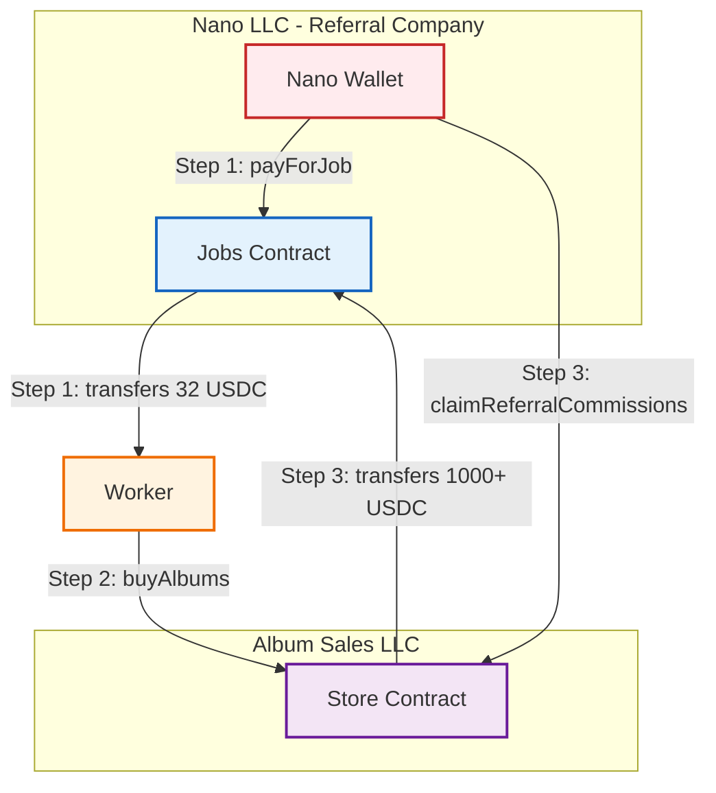

# HitMachine - Gift Card Purchase System

**Live Deployment**: [https://hitmachine-nano.vercel.app](https://hitmachine-nano.vercel.app)

## Simple Flow Diagram



## How It Works

### The Cycle ♻️

1. **Nano pays worker** → Jobs contract sends 31.96 USDC to worker
2. **Worker buys albums** → Uses 31.96 USDC to purchase 4 albums @ $7.99 each
3. **Nano claims commission** → After sales accumulate, claims 1000+ USDC back to Jobs
4. **Repeat** → Jobs contract now has funds for 30+ more workers

## Quick Start

```bash
# Install
npm install

# Run frontend
cd frontend && npm run dev

# Deploy contracts
forge script script/Deploy.s.sol --rpc-url <RPC_URL> --broadcast --zksync
```

## Smart Contracts

- **Jobs Contract**: Pays workers and receives commissions
- **Store Contract**: Sells albums and pays referral commissions
- **Network**: Sophon (zkSync L2)

## Key Methods

```solidity
// Jobs Contract
Jobs.payForJob(workerAddress)  // Pay 31.96 USDC to worker

// Store Contract  
Store.buyAlbums()  // Purchase albums with USDC
Store.claimReferralCommissions(jobsAddress, amount)  // Claim earned commissions
```

## Environment Setup

```env
WALLET_PRIVATE_KEY=0x...
MNEMONIC="..."
NEXT_PUBLIC_TESTNET_JOBS_CONTRACT=0x...
NEXT_PUBLIC_TESTNET_STORE_CONTRACT=0x...
NEXT_PUBLIC_MAINNET_JOBS_CONTRACT=0x...
NEXT_PUBLIC_MAINNET_STORE_CONTRACT=0x...
```

## API Endpoints

- `/api/generate-account` - Create funded wallet (`?testnet` for testnet)
- `/api/purchase-album` - Execute album purchase (`?testnet` for testnet)

## Documentation

- [System Architecture](./SYSTEM_ARCHITECTURE.md)
- [Deployment Guide](./docs/DEPLOYMENT.md)
- [Contract Details](./CONTRACTS_README.md)