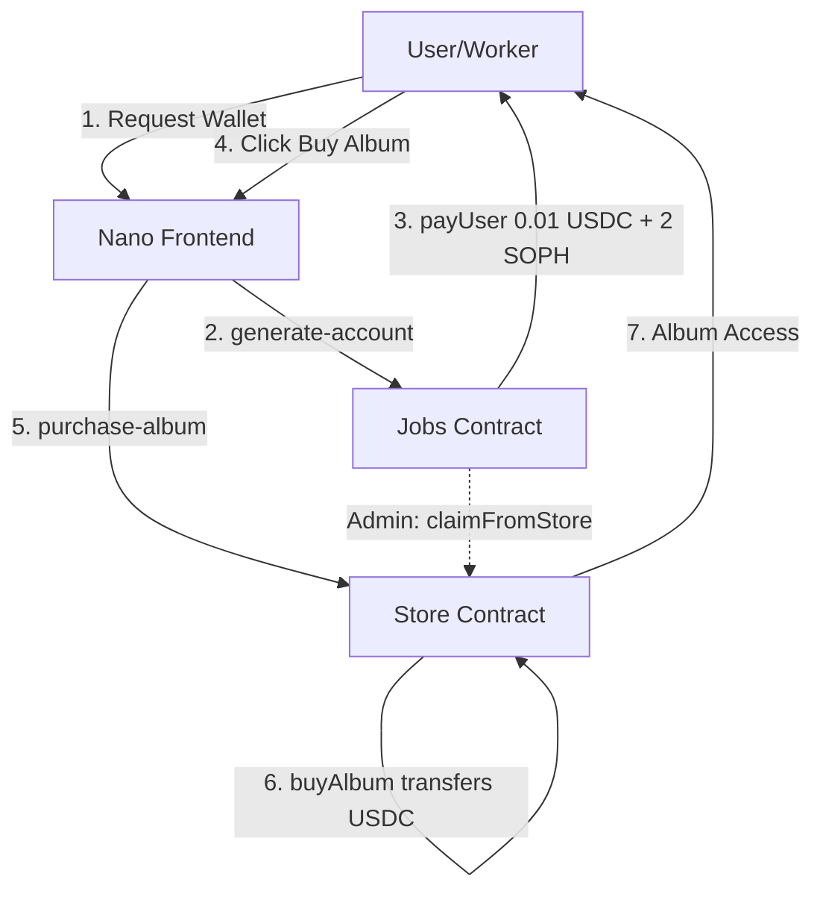

# HitMachine - Blockchain Album Purchase System

A decentralized album purchase system built on Sophon (zkSync) that enables gasless transactions through paymaster integration.

## System Flow



## How It Works

### 1. Wallet Generation
- User visits site without a wallet
- Frontend calls `/api/generate-account`
- Jobs contract sends user 0.01 USDC + 2 SOPH for gas
- Wallet address stored in Vercel KV for tracking

### 2. Album Purchase  
- User clicks "Buy Album" (costs 0.01 USDC)
- Frontend calls `/api/purchase-album`
- Store contract's `buyAlbum()` method transfers USDC
- Purchase recorded on-chain

### 3. Revenue Flow
- Album revenue accumulates in Store contract
- Admin can call `claimFromStore()` on Jobs contract
- Jobs pulls funds from Store for redistribution

## Smart Contracts (Sophon Testnet)

- **Store Contract**: Handles album sales and purchase tracking
- **Jobs Contract**: Manages fund distribution and wallet funding
- **MockUSDC**: Test USDC token for development
- **Paymaster**: `0x98546B226dbbA8230cf620635a1e4ab01F6A99B2` (sponsors gas fees)

## Key Methods

### Jobs Contract
- `payUser(address user, uint256 usdcAmount, uint256 sophAmount)` - Funds new wallets
- `claimFromStore()` - Claims revenue from Store contract
- `depositFunds()` - Add funds to Jobs for distribution

### Store Contract  
- `buyAlbum()` - Purchase an album for 0.01 USDC
- `hasPurchased(address)` - Check if user already purchased
- `withdrawAll(address)` - Admin withdraws accumulated revenue

## Tech Stack

- **Smart Contracts**: Solidity + OpenZeppelin (UUPS Upgradeable)
- **Blockchain**: Sophon (zkSync L2)
- **Frontend**: Next.js 14 + TypeScript
- **Wallet**: RainbowKit + Wagmi
- **Storage**: Vercel KV + Supabase
- **Deployment**: Vercel + GitHub Actions

## Development

```bash
# Install dependencies
npm install

# Run frontend locally
cd frontend && npm run dev

# Compile contracts  
forge build --zksync

# Deploy contracts
forge script script/DeployTestnet.s.sol --rpc-url https://rpc.testnet.sophon.xyz --broadcast --zksync

# Run tests
forge test
```

## Environment Variables

```env
# Frontend (.env.local)
NEXT_PUBLIC_STORE_CONTRACT=0x...
NEXT_PUBLIC_JOBS_CONTRACT=0x...
NEXT_PUBLIC_USDC_ADDRESS=0x...
WALLET_PRIVATE_KEY=0x...
MNEMONIC="..."
KV_REST_API_URL=...
SUPABASE_URL=...
```