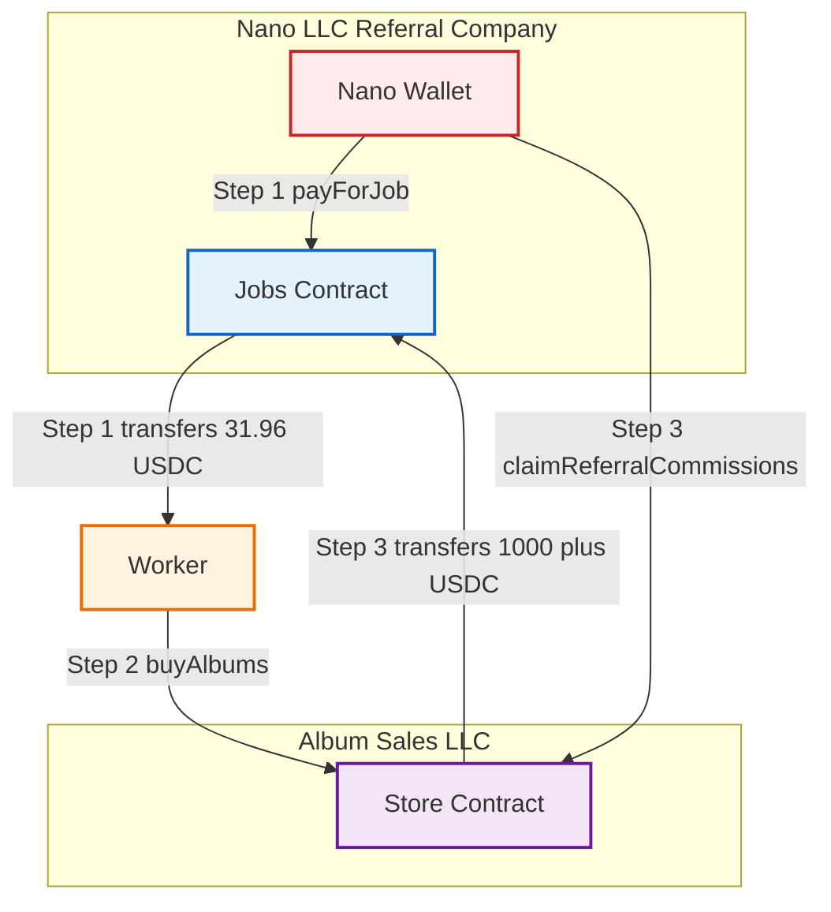
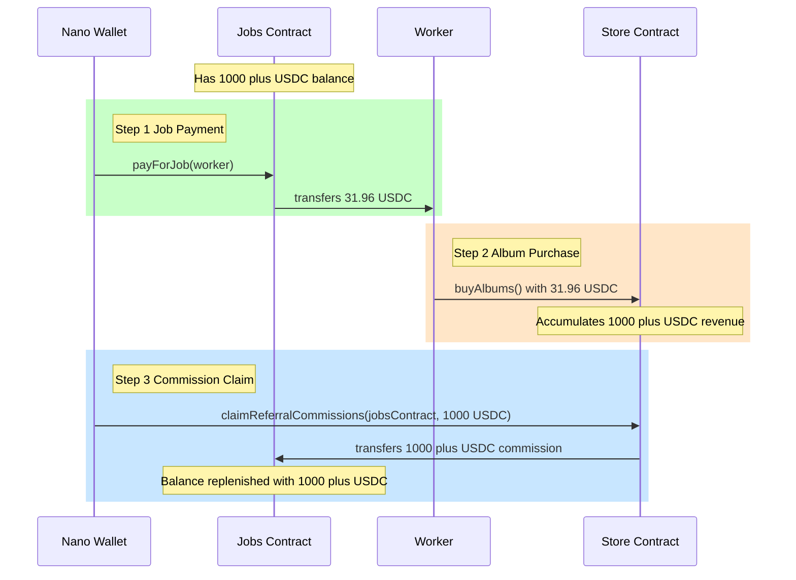

# HitMachine - System Flow

## Legal Entities

### Nano LLC (Wyoming - Referral Marketing Company)
- **Owns**: Jobs Contract
- **Business**: User acquisition and referral marketing
- **Revenue**: Earns commissions from Album Sales LLC
- **Jurisdiction**: Wyoming LLC

### Album Sales LLC (Wyoming - E-commerce Company)
- **Owns**: Store Contract  
- **Business**: Sells digital albums
- **Obligation**: Pays referral commissions to Nano LLC per agreement
- **Jurisdiction**: Wyoming LLC

## Entity Relationship Diagram



## Sequence Flow Diagram



## How It Works

### 1️⃣ **Bootstrap** (One-time)
- Nano company funds Jobs contract with initial USDC (1000 plus for multiple jobs)
- This provides starting capital for user acquisition at scale

### 2️⃣ **User Acquisition**
```solidity
Jobs.payForJob(workerAddress)
```
- Nano calls this to pay workers 31.96 USDC
- Workers create and fund user wallets

### 3️⃣ **Album Purchase**
```solidity
Store.buyAlbums()
```
- Users (workers) call this with their 31.96 USDC
- Automatically purchases 4 albums (at 7.99 USDC each)
- Revenue accumulates in Store contract

### 4️⃣ **Commission Claim**
```solidity
Store.claimReferralCommissions(jobsAddress, amount)
```
- Nano claims earned commissions from Store (typically 1000 plus USDC)
- Directs them to Jobs contract
- Jobs contract now has funds for many more workers (30 plus jobs)

### 5️⃣ **Cycle Continues** ♻️

The circular flow:

- Nano LLC pays worker from Jobs contract (31.96 USDC per job)
- Worker buys 4 albums from Store (31.96 USDC = 4 albums @ $7.99 each)
- After many purchases accumulate, Nano LLC claims large commission from Store (1000 plus USDC)
- Commission goes back to Jobs contract
- Jobs contract can now pay 30 plus more workers
- **Circle complete - cycle scales up!**

After initial funding, the system runs on commissions - no additional capital needed!

## Key Points

- 31.96 USDC = Standard job payment and album purchase amount
- Jobs contract maintains 1000 plus USDC balance for continuous operations
- Commission claims are batched (1000 plus USDC) for efficiency
- Two Companies: Nano (referral) and Store (sales) with legal agreement
- Self-Sustaining: After initial funding, commissions fund future operations
- Simple Flow: Just 3 main contract calls in the cycle

## Contract Methods

### Jobs Contract
- `payForJob(address worker)` - Pays 31.96 USDC to worker

### Store Contract  
- `buyAlbums()` - Purchases albums with available USDC
- `claimReferralCommissions(address destination, uint256 amount)` - Nano claims commissions

## Roles

- **Nano**: Has `JOB_PAYER_ROLE` in Jobs, `COMMISSION_CLAIMER_ROLE` in Store
- **Store Admin**: Separate entity, manages Store contract
- **Users**: No special roles, just call `buyAlbums()`