# HitMachine - System Flow

## Legal Entities

### Nano LLC (Referral Marketing Company)
* Owns: Jobs Contract
* Business: User acquisition and referral marketing
* Revenue: Earns commissions from Album Sales LLC

### Album Sales LLC (E-commerce Company)
* Owns: Store Contract  
* Business: Sells digital albums
* Obligation: Pays referral commissions to Nano LLC per agreement

## Simple Flow Diagram

```mermaid
graph TB
    %% Main entities
    subgraph "Nano LLC (Referral Company)"
        NANO["🏢 Nano Wallet"]
        JOBS["📋 Jobs Contract<br/>Pays Workers"]
    end
    
    subgraph "Album Sales LLC"
        STORE["🏪 Store Contract<br/>Sells Albums"]
    end
    
    USER["👤 User/Worker<br/>(Receives 32 USDC)"]
    
    %% The circular flow
    NANO ==>|"1. Initial funding<br/>💰 32 USDC<br/>(one-time)"| JOBS
    NANO -->|"2. payForJob(worker)"| JOBS
    JOBS ==>|"3. Transfers<br/>💰 32 USDC"| USER
    USER ==>|"4. buyAlbums()<br/>💰 32 USDC"| STORE
    STORE -.->|"5. Revenue sits<br/>in Store"| STORE
    NANO ==>|"6. claimReferralCommissions<br/>(jobs_address, 32)"| STORE
    STORE ==>|"7. Sends commission<br/>💰 32 USDC"| JOBS
    JOBS -.->|"8. Ready to pay<br/>next worker<br/>♻️ CYCLE CONTINUES"| NANO
    
    %% Highlight the circular path
    JOBS -.->|"♻️"| NANO
    
    %% Styling
    style NANO fill:#ffebee,stroke:#c62828,stroke-width:3px
    style JOBS fill:#e3f2fd,stroke:#1565c0,stroke-width:3px
    style USER fill:#fff3e0,stroke:#ef6c00,stroke-width:2px
    style STORE fill:#f3e5f5,stroke:#6a1b9a,stroke-width:3px
    
    classDef nanoClass fill:#ffebee,stroke:#c62828,stroke-width:3px
    classDef storeClass fill:#f3e5f5,stroke:#6a1b9a,stroke-width:3px
```



## How It Works

### 1️⃣ **Bootstrap** (One-time)
- Nano company funds Jobs contract with initial USDC
- This provides starting capital for user acquisition

### 2️⃣ **User Acquisition**
```solidity
Jobs.payForJob(workerAddress)
```
- Nano calls this to pay workers 32 USDC
- Workers create and fund user wallets

### 3️⃣ **Album Purchase**
```solidity
Store.buyAlbums()
```
- Users (workers) call this with their 32 USDC
- Automatically purchases 3200 albums (at 0.01 USDC each)
- Revenue accumulates in Store contract

### 4️⃣ **Commission Claim**
```solidity
Store.claimReferralCommissions(jobsAddress, amount)
```
- Nano claims earned commissions from Store
- Directs them to Jobs contract
- Jobs contract now has funds for more workers

### 5️⃣ **Cycle Continues** ♻️

The circular flow:
1. Nano LLC pays worker from Jobs contract (32 USDC)
2. Worker buys albums from Store (32 USDC)
3. Nano LLC claims commission from Store (32 USDC)
4. Commission goes back to Jobs contract
5. Jobs contract can now pay another worker
6. **Circle complete - cycle repeats!**

After initial funding, the system runs on commissions - no additional capital needed!

## Key Points

* 32 USDC = Standard amount throughout the system
* Two Companies: Nano (referral) and Store (sales) with legal agreement
* Self-Sustaining: After initial funding, commissions fund future operations
* Simple Flow: Just 3 main contract calls in the cycle

## Contract Methods

### Jobs Contract
* `payForJob(address worker)` - Pays 32 USDC to worker
* `receiveFunds(uint256 amount)` - Accepts commission funds

### Store Contract  
* `buyAlbums()` - Purchases albums with available USDC
* `claimReferralCommissions(address destination, uint256 amount)` - Nano claims commissions

## Roles

* Nano: Has `JOB_PAYER_ROLE` in Jobs, `COMMISSION_CLAIMER_ROLE` in Store
* Store Admin: Separate entity, manages Store contract
* Users: No special roles, just call `buyAlbums()`