# HitMachine System Architecture

## Entity Relationship Diagram

```mermaid
graph TB
    subgraph "External Entities"
        NANO[["🔑 Nano Wallet<br/>(System Operator)"]]
        WORKER[["👷 Workers<br/>(Job Completers)"]]
        USER[["👤 Users<br/>(Album Buyers)"]]
        ADMIN[["⚙️ Admin<br/>(System Admin)"]]
    end
    
    subgraph "Smart Contracts"
        JOBS["📋 Jobs Contract<br/>━━━━━━━━━━━<br/>Pays workers for jobs<br/>Receives commission funds<br/>Tracks job payments"]
        
        STORE["🏪 Store Contract<br/>━━━━━━━━━━━<br/>Sells albums<br/>Collects revenue<br/>Distributes commissions"]
    end
    
    subgraph "Token Contracts"
        USDC[["💵 USDC Token<br/>(Payment Currency)"]]
    end

    %% Nano Wallet Interactions
    NANO -->|"1. Initial Funding<br/>(Bootstrap Phase)"| JOBS
    NANO -->|"2. payForJob()<br/>(JOB_PAYER_ROLE)"| JOBS
    NANO -->|"7. claimReferralCommissions()<br/>(COMMISSION_CLAIMER_ROLE)"| STORE
    
    %% Jobs Contract Interactions
    JOBS -->|"3. Transfer USDC<br/>(Job Payment)"| WORKER
    JOBS -.->|"Receives USDC<br/>(From Store via Nano)"| JOBS
    
    %% Worker Interactions
    WORKER -->|"4. Creates & Funds<br/>New User Wallet"| USER
    
    %% User Interactions
    USER -->|"5. buyAlbums()<br/>(0.01 USDC per album)"| STORE
    USER -->|"approve()<br/>USDC Spending"| USDC
    
    %% Store Contract Interactions
    STORE -->|"6. Accumulates<br/>Revenue"| STORE
    STORE -->|"8. Transfer USDC<br/>(Commissions to Jobs)"| JOBS
    
    %% USDC Token Interactions
    USDC -.->|"transferFrom()"| STORE
    USDC -.->|"transfer()"| WORKER
    USDC -.->|"transfer()"| JOBS
    
    %% Admin Interactions
    ADMIN -->|"Grant Roles<br/>Upgrade Contracts<br/>Emergency Functions"| JOBS
    ADMIN -->|"Grant Roles<br/>Upgrade Contracts<br/>Emergency Functions"| STORE

    %% Styling
    classDef entity fill:#e1f5fe,stroke:#01579b,stroke-width:2px
    classDef contract fill:#fff3e0,stroke:#e65100,stroke-width:2px
    classDef token fill:#f3e5f5,stroke:#4a148c,stroke-width:2px
    classDef nano fill:#ffebee,stroke:#b71c1c,stroke-width:3px
    
    class NANO nano
    class WORKER,USER,ADMIN entity
    class JOBS,STORE contract
    class USDC token
```



## Legal Structure & Entities

### 🏢 **Two Separate Companies**

1. **Nano Company** (Referral/Marketing Company)
   - Operates the Jobs contract
   - Handles user acquisition and referral programs
   - Pays workers for generating new users
   - Has legal agreement with Store Company for commissions

2. **Store Company** (Album Sales Company)
   - Operates the Store contract
   - Sells albums to users
   - Pays referral commissions to Nano per agreement
   - Separate legal entity from Nano

### 📄 **Legal Agreement**
The two companies have a formal referral/commission agreement that specifies:
- Commission rates and payment terms
- Nano's right to claim commissions from Store
- Performance metrics and obligations
- Legal compliance and tax responsibilities

## Entity Descriptions

### 🔑 **Nano Wallet** (Referral Company Operator)
- **Legal Entity**: Separate company from Store
- **Type**: External Account (EOA) controlled by Nano Company
- **Roles**: 
  - `JOB_PAYER_ROLE` in Jobs Contract (owns this contract)
  - `COMMISSION_CLAIMER_ROLE` in Store Contract (granted per legal agreement)
- **Functions**:
  - Initially funds the Jobs contract (bootstrap investment)
  - Pays workers for completing user acquisition jobs
  - Claims earned referral commissions from Store Company
  - Directs commissions back to Jobs contract for sustainability
- **Business Model**: User acquisition and referral marketing

### 👷 **Workers** (Job Completers)
- **Type**: External Accounts (EOAs)
- **Functions**:
  - Complete jobs (e.g., wallet generation)
  - Receive USDC payments from Jobs contract
  - Create and fund new user wallets
- **Compensation**: USDC for each job completed

### 👤 **Users** (Album Buyers)
- **Type**: External Accounts (EOAs)
- **Functions**:
  - Receive funded wallets from workers
  - Purchase albums from Store
  - Generate revenue for the system
- **Cost**: 0.01 USDC per album

### ⚙️ **Admin** (System Administrator)
- **Type**: External Account (EOA)
- **Roles**:
  - `DEFAULT_ADMIN_ROLE` in both contracts
  - `ADMIN_ROLE` in both contracts
- **Functions**:
  - Grant/revoke roles
  - Upgrade contracts (UUPS pattern)
  - Emergency withdrawals
  - Pause/unpause system

### 📋 **Jobs Contract**
- **Type**: Upgradeable Smart Contract
- **Owner**: Nano Company (referral/marketing company)
- **State Variables**:
  - `standardJobAmount`: Standard payment per job (32 USDC)
  - `totalUsdcPaidForJobs`: Total USDC spent on jobs
  - `totalJobsPaid`: Number of jobs paid
- **Key Functions**:
  - `payForJob(worker)`: Pay worker standard amount for job
  - `receiveFunds(amount)`: Accept commission funds from Store
  - `setStandardJobAmount()`: Update standard payment amount
- **Funding**: Initially from Nano Company, then from earned commissions

### 🏪 **Store Contract**
- **Type**: Upgradeable Smart Contract
- **Owner**: Store Company (separate legal entity)
- **State Variables**:
  - `albumPrice`: Price per album (0.01 USDC)
  - `totalPurchases`: Number of albums sold
  - `totalRevenue`: Total USDC collected
- **Key Functions**:
  - `buyAlbums()`: Purchase multiple albums
  - `claimReferralCommissions(destination, amount)`: Nano claims commissions (per legal agreement)
  - `updatePrice()`: Store admin updates album price
- **Commission Obligation**: Must allow Nano to claim commissions per referral agreement

### 💵 **USDC Token**
- **Type**: ERC20 Token Contract
- **Address**: `0x9Aa0F72392B5784Ad86c6f3E899bCc053D00Db4F` (Sophon)
- **Purpose**: Primary payment currency for the system
- **Usage**:
  - Job payments
  - Album purchases
  - Commission transfers

## Interaction Flow

### Step-by-Step Process:

1. **Bootstrap Phase**
   - Nano wallet deposits initial USDC into Jobs contract
   - Admin grants necessary roles to Nano wallet

2. **Job Payment**
   - Nano wallet calls `Jobs.payForJob(worker, amount)`
   - Worker receives USDC for completing job

3. **User Onboarding**
   - Worker creates new user wallet
   - Worker funds user wallet with USDC

4. **Album Purchase**
   - User approves USDC spending to Store
   - User calls `Store.buyAlbums()`
   - Store automatically purchases maximum albums based on balance

5. **Revenue Accumulation**
   - Store contract accumulates USDC from album sales
   - Tracks total purchases and revenue

6. **Commission Claiming**
   - Nano wallet calls `Store.claimReferralCommissions(jobsAddress, amount)`
   - Store transfers USDC to Jobs contract

7. **Cycle Continues**
   - Jobs contract now has funds for more job payments
   - System becomes self-sustaining

## Role Permissions Matrix

| Entity | Jobs Contract | Store Contract |
|--------|--------------|----------------|
| **Nano Wallet** | `JOB_PAYER_ROLE` | `COMMISSION_CLAIMER_ROLE` |
| **Admin** | `DEFAULT_ADMIN_ROLE`<br/>`ADMIN_ROLE` | `DEFAULT_ADMIN_ROLE`<br/>`ADMIN_ROLE`<br/>`OPERATOR_ROLE`<br/>`WITHDRAWER_ROLE` |
| **Workers** | - | - |
| **Users** | - | - |

## Legal & Compliance Framework

### Business Relationship
- **Separate Entities**: Nano Company and Store Company are independent legal entities
- **Referral Agreement**: Formal contract governing commission payments
- **Smart Contract Enforcement**: On-chain implementation of legal agreement terms
- **Audit Trail**: All commission claims and payments recorded on blockchain

### Commission Structure
- **Referral Source**: Users acquired through Nano's marketing efforts
- **Commission Rights**: Nano entitled to claim revenue from referred sales
- **Payment Mechanism**: Direct on-chain settlement via smart contracts
- **Tax Responsibilities**: Each company handles own tax obligations

## Security Model

### Access Control
- **Role-Based**: Uses OpenZeppelin AccessControl
- **Cross-Company Permissions**: Nano has specific role in Store per agreement
- **Separation of Concerns**: Different roles for different functions
- **Minimal Permissions**: Each entity has only necessary permissions

### Fund Safety
- **No Reentrancy**: Simple transfer patterns
- **Pausable**: Both contracts can be paused
- **Emergency Withdrawal**: Admin can recover funds if needed

### Upgrade Safety
- **UUPS Pattern**: Secure upgrade mechanism
- **Admin Only**: Only admin can upgrade contracts
- **Initializer Protection**: Prevents re-initialization

## Economic Flow Summary

```
🏢 Nano Company (Marketing/Referral Business)
    ↓ (Initial Investment)
📋 Jobs Contract (Nano-owned)
    ↓ (Job Payments)
👷 Workers
    ↓ (User Acquisition)
👤 Users
    ↓ (Album Purchases)
🏪 Store Contract (Store Company-owned)
    ↓ (Referral Commissions per Agreement)
📋 Jobs Contract (Nano-owned)
    ↓
♻️ Self-Sustaining Referral Business
```

### Business Model:

**Nano Company (Referral Business)**:
- Invests in user acquisition
- Pays workers to generate users
- Earns commissions from successful referrals
- Reinvests commissions into more user acquisition

**Store Company (Sales Business)**:
- Sells albums to users
- Benefits from Nano's user acquisition
- Pays commissions per referral agreement
- Focuses on product and sales operations

### Key Success Metrics:
- **For Nano**: Commission revenue > User acquisition costs
- **For Store**: Album sales revenue > Commission payments
- **Win-Win**: Both companies benefit from user growth
- **Self-Sustaining**: When Nano's commissions fund ongoing operations